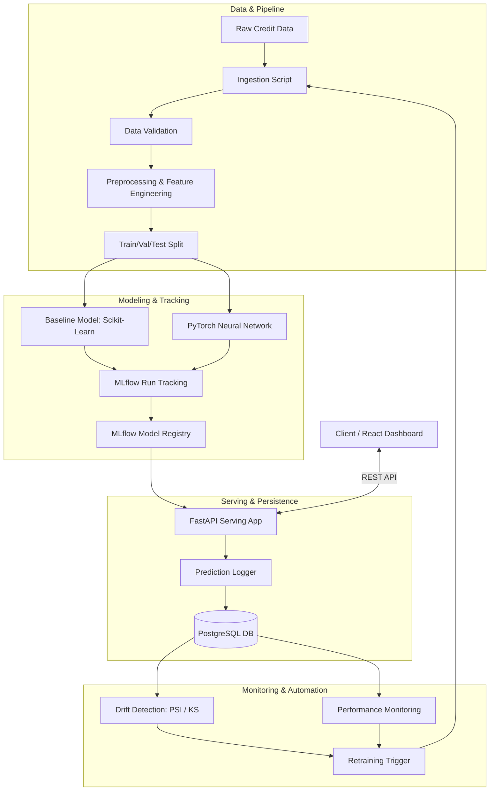

# CreditRiskML — End-to-End Credit Risk ML & MLOps Platform

CreditRiskML is an end-to-end, production-grade credit risk modeling and MLOps platform. The project demonstrates the entire machine learning lifecycle: data ingestion, validation, preprocessing, feature engineering, classical and deep learning model training, experiment tracking, model registry, local containerized serving, prediction logging, real-time data drift monitoring, and automated retraining.

## Problem

Credit risk assessment is the process where lenders evaluate the likelihood of a borrower defaulting on a debt. In modern banking, relying on manual underwriting is slow and prone to bias. Machine learning models can analyze financial histories, loan features, and macroeconomic indicators to predict default probabilities accurately, reducing financial losses while maximizing lending efficiency.

## Solution

This platform automates credit risk prediction. Users can submit borrower application details via a REST API or interactive dashboard, receiving immediate default probability scores, categorical risk ratings (Low, Medium, High Risk), and explanation metrics. The platform logs predictions, monitors drift in input distributions, and automatically triggers retraining when performance degrades or data drift exceeds thresholds.

## Architecture



## ML Pipeline

- **Data Ingestion**: Automates fetching or local ingestion of credit risk data.
- **Validation**: Enforces strict column schemas, range checks, and null-value tolerances.
- **Preprocessing**: Handles missing values, performs one-hot encoding, and scales numerical features securely without data leakage.
- **Feature Engineering**: Calculates debt-to-income ratios, loan-to-income ratios, and other credit-relevant indicators.
- **Training**: Compares classical models (Logistic Regression, etc.) against custom PyTorch Feedforward Neural Networks.
- **Model Selection**: Promotes models based on precision-recall curves and ROC-AUC metrics instead of simple accuracy.

## MLOps Pipeline

- **MLflow**: Tracks hyperparameter configurations, metrics, and saves model artifacts.
- **Model Registry & Versioning**: Registers candidates and marks production models.
- **FastAPI serving**: Low-latency endpoints supporting single and batch inference.
- **PostgreSQL Persistence**: Saves inference queries, latencies, predictions, and ground-truth matches.
- **Drift Detection**: Runs statistical tests (e.g. PSI or KS-test) on incoming feature distributions against baseline training distributions.
- **Automated Retraining**: Promotes new models based on performance comparisons.

## Tech Stack

- **Backend**: Python 3.11+, FastAPI, Uvicorn, Pydantic
- **Data & ML**: Pandas, NumPy, Scikit-learn, PyTorch, Pandera
- **Database**: PostgreSQL, SQLAlchemy
- **MLOps & Tracking**: MLflow, Docker, Docker Compose
- **Testing**: Pytest

## Dataset

The platform is trained and evaluated on the **Statlog (German Credit Data)** from the UCI Machine Learning Repository:

- **Total Records**: 1,000 credit applications
- **Features**: 20 financial and personal attributes (7 numerical, 13 categorical) covering checking status, credit history, loan purpose, credit amount, savings, employment duration, property, age, housing, and existing credits.
- **Engineered Features**: Debt-to-duration ratio, monthly installment rate burden, age-to-duration ratio, guarantor flags, savings safety net indicators, and employment status indicators.
- **Target Variable**: `credit_risk` (0 = Good / Low Risk [70%], 1 = Bad / Default [30%]).
- **Splits**: Leakage-free, stratified train/val/test splits (70% Train, 15% Validation, 15% Test).

## Model Performance

The platform evaluates models on an out-of-sample holdout test set (150 credit applications) with optimized decision thresholds targeting high recall to minimize credit default losses:

| Model | Role | Decision Threshold | Precision | Recall | F1 | ROC-AUC | PR-AUC | Brier Score |
| :--- | :--- | :---: | :---: | :---: | :---: | :---: | :---: | :---: |
| **Logistic Regression** | **Champion** (Active) | 0.47 | **0.5075** | **0.7556** | **0.6071** | 0.7681 | 0.5751 | 0.1949 |
| **PyTorch CreditRiskNet** | **Challenger** | 0.80 | 0.6818 | 0.3333 | 0.4478 | **0.7776** | **0.6222** | **0.1864** |

> [!NOTE]
> Logistic Regression is currently promoted as **Champion** because its tuned decision threshold achieves high default recall (**75.56%**), directly prioritizing risk capture over conservative predictions in credit underwriting.

## API

### Endpoints:
- `GET /`: API entry point/welcome (returns dashboard UI when accessed in browser).
- `GET /dashboard`: Interactive Underwriter & MLOps web dashboard.
- `GET /health`: System health and configuration details.
- `GET /model`: Returns currently active model metadata.
- `POST /predict`: Submit application info for single-borrower default prediction.
- `POST /predict/batch`: Submit a batch of borrowers for asynchronous scoring.
- `GET /metrics`: Prometheus-like runtime metrics and latency percentiles.
- `GET /monitoring/drift`: Get statistical drift reports (PSI & KS-tests).
- `GET /monitoring/performance`: Retrieve performance degradation statuses.
- `POST /retrain`: Trigger automated model retraining pipeline.

## Monitoring

Tracks population stability index (PSI) and Kolmogorov-Smirnov (KS) statistics for input parameters. Alerts developers of feature distribution shifts.

## Retraining

Runs automated evaluation scripts to compare newly trained models against the active model. Replaces the active model in the registry only when promotion criteria (e.g. ROC-AUC improvement and F1 safety bounds) are satisfied.

## Installation

```bash
git clone https://github.com/Hasinipachimatla/credit-risk-ml.git
cd credit-risk-ml
python -m venv venv
source venv/bin/activate  # On Windows: venv\Scripts\activate
pip install -r requirements.txt
```

## Running Locally

### 1. Database Migrations
```bash
alembic upgrade head
```

### 2. (Optional) Re-run Data Ingestion & Model Training
```bash
python -m src.data.ingestion
python -m src.models.train
python -m src.models.train_pytorch
```

### 3. Launch FastAPI Server
```bash
uvicorn app.main:app --reload
```

## Docker

```bash
docker compose up --build
```

## MLflow

```bash
mlflow server --host 127.0.0.1 --port 5000
```

## Testing

```bash
pytest
```

## Project Structure

```
credit-risk-ml/
├── app/                  # FastAPI Web server application
│   ├── api/              # Routers, endpoints, schemas
│   ├── database/         # SQLAlchemy models and connections
│   ├── services/         # Prediction, monitoring, database logic
│   └── config.py         # Config loader
├── src/                  # ML core pipeline codebase
│   ├── data/             # Ingestion, validation, and preprocessing
│   ├── features/         # Feature engineering
│   ├── models/           # Training, evaluation, and inference
│   └── monitoring/       # Drift, metrics, retraining scripts
├── notebooks/            # Jupyter notebooks for EDA and validation
├── tests/                # System and unit tests
├── requirements.txt      # Project requirements
└── README.md             # This document
```

## Limitations

- Basic local file storage for models initially.
- Database runs locally or in local Docker; not configured for high-availability distributed operations.

## Future Improvements

- Kubernetes deployment configs (Helm charts).
- Real-time Kafka-based prediction logging stream.
- Feature store integration (e.g. Feast).
